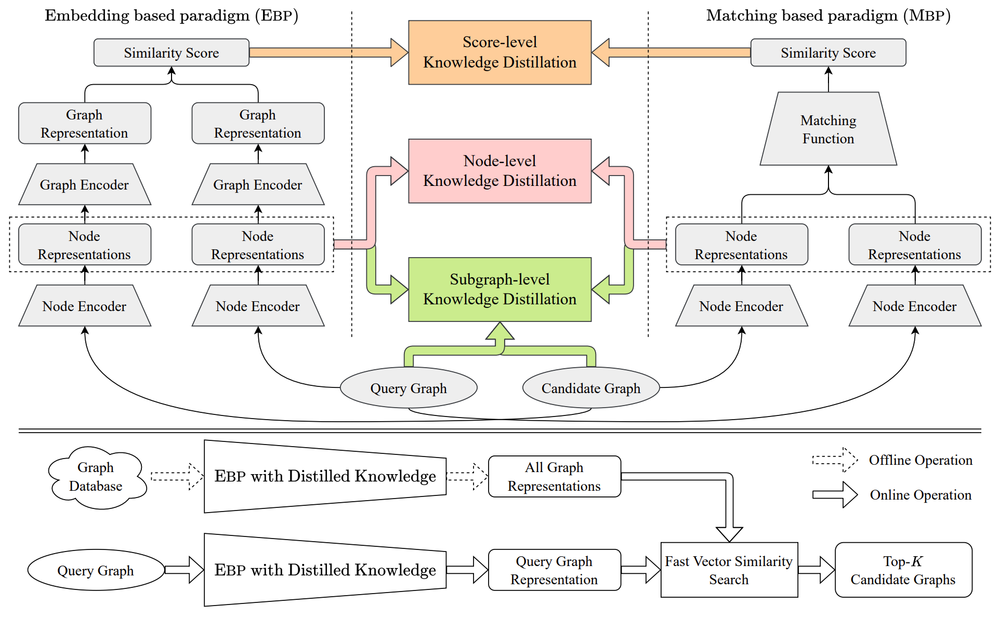

# GRAND

### Grand is *a fast and accurate graph retrieval framework via knowledge distillation*

<center></center>

<center>Fig. 1: A schematic description of our framework GRAND.</center>

As Fig. 1 illustrates, GRAND leverage the idea of knowledge distillation to transfer the fine-grained graph comparison knowledge from an MBP model to an EBP model. Towards this end, we propose to perform knowledge distillation from three perspectives: `score`, `node`, and `subgraph` levels. In addition, compared with the vanilla one-way transfer from MBP to EBP, we further propose to perform mutual two-way knowledge transfer between MBP and EBP, such that MBP and EBP complement and benefit each other.

This framework GRAND allow the EBP model to generate better graph representations and thus yield higher retrieval accuracy. At the same time, it retains the retrieval speed of EBP model by pre-computing and indexing the improved graph representations.

## Installation

GRAND requires Python 3.7+ and Tensorflow 2.4+

We strongly recommend creating a conda environment using:

```
conda create -n GRAND python=3.7
conda activate GRAND
bash envs.sh
```

## Overview

Using GRAND on a dataset typically involves the following steps.

**Step 0: Preprocess your datasets.** 
GRAND works with four datasets: Aids, CCI, OpenSSL, FFmepeg. Before training, it will generate bathced val/test data and partitions files based on the data files.

**Step 1: Train a model.** 
You can train a graph neural network model and validate performance on a dataset through GRAND.

**Step 2: Search the candidate set with your query graph.** 
Given your model, you can issue queries over the candidate set to retrieve the top-k graphs for each query graph.

Below, we illustrate these steps via an example run on the AIDS dataset.

## Data

We conduct experiments on four real-world datasets to comparatively evaluate our proposed framework. 

* **AIDS**: This is an antiviral screening compound dataset from the Developmental Therapeutics Programat NCI/NIH. We use a subset of the dataset, which contains 700 graphs and the true GED between each pair of graphs obtained by the exponential-time exact GED computation algorithm.

* **CCI**: This dataset is constructed based on the chemical-chemical interactions from the STITCH6 database (version 5.0). The STITCH database contains a set of interaction pairs of chemical compounds. We use RDKit7 to convert the SMILES string of each compound to a graph.

* **FFmpeg**: This is a collection of Control-Flow Graphs (CFGs) of binary functions compiled from FFmpeg. This dataset uses GCC v5.4 and Clang v3.8 to compile FFmpeg with 4 different compiler optimization levels (O0-O3). Thus, each source function corresponds to 8 different CFGs. 

* **OpenSSL**: This dataset is composed of ControlFlow Graphs (CFGs) of binary functions compiled from OpenSSL. In this dataset, OpenSSL (versions 1.0.1f and 1.0.1u) is compiled using GCC v5.4 with optimization levels O0-O3 on architectures x86, MIPS, and ARM.

For each of the three datasets, we split the graphs into three parts: training graphs, validation graphs, and test graphs. Specifically, for AIDS dataset, we use 420 graphs as training graphs and the other graphs are divided equally into validation graphs, and test graphs. For CCI, FFmpeg and OpenSSL datasets, we first randomly sample 90% of the graphs, of which 1, 000 graphs are used as validation graphs and the rest are used as training graphs, and the remaining 10% of the graphs are used as test graphs.


## Training

You can chose train with knowledge distillation or standalone through `model_name` parameter and chose teacher/student model through `teacher_name/student_name` parameter.

Alternatively, you can change three different level knowledge distillation in which you should change `kd_score_coeff`, `kd_node_coeff` and `kd_subgraph_coeff`.

```
python trainer.py --gpu 1 --data_name aids700 \
--model_name dml --student_name gnn --teacher_name graphsim \
--kd_score_coeff 0.7 --kd_node_coeff 0.01 --kd_subgraph_coeff 0.01 \
--batch_size 32 --n_training_steps 15000
```

You can use one or more GPUs by modifying `gpu` parameter.

What'more, we use **Ray.tune** to realize automatic parameter search. You can set different parameter combinations, we have five parameters in the command that can set multiple values: `kd_score_coeff`, `kd_node_coeff`, `kd_subgraph_coeff`, `batch_size`, `n_training_steps`. After setting the value, tune will automatically combine the parameters and train the corresponding models. Using tune will greatly facilitate parameter search and find the best combination of parameters, especially for the searching of three different level knowledge distillation coeffs.

```
python tune.py --gpu 0,1 --num_seed 5 \
--data_name aids700 --model_name dml --student_name gnn --teacher_name graphsim \
--kd_score_coeff 0.7 --kd_node_coeff 0.01 0.1 --kd_subgraph_coeff 0.01 \
--batch_size 32 --n_training_steps 15000 --num_cpu 0.0 --num_gpu 0.5
```

In addition, you can change the CPU and GPU resources used by each trial by adjusting the `num_cpu` and `num_gpu` parameters.

## Validation

Before retrieving graphs, you can compare a few parameters by analysising the performance in validation set and test set. 

This script need input the model training log directory generated from `train.py`  or `tune.py` . Then different model parameters will be compared through the top-k metrics in validation set and test set. So you can easily find the best model parameters by `anlysis.py`.

Example command:

```
python analysis.py \
--logdir ./ray_results/ffmpeg/GraphSearch_ffmpeg_GRID_dml_graphsim_gnn_2022-06-29_16-52-27 \
--max_iter 120000 --top_val 20 --top_test 20
```

## Retrieval

After training and validation, now you can use graph neural model to retrieve graphs.

In the simplest case, you want to retrieve from the AIDS dataset:

```
python retrieve.py \
--path ./ray_results/aids700/GraphSearch_aids700_GRID_dml_graphsim_gnn_2022-11-02_10-35-58/Trainer_156ef_00000_0_ablation_dele_combine=False,batch_size=32,graphsim_encoder=gnn,kd_node_coeff=0.7,kd_score_T=1.0,kd_score_coeff=0.7,kd_subgraph_coeff=0.01,lr=0.001,model_name=dml,neighbor_enhanced=False,seed=6821,st_2022-11-02_10-35-58/ \
--gpu 0 --topk 5 10 20 50 100 \
--sample False
```

We provide a `--sample` parameter, which provides visual results. This is a dataset generated based on AIDS data, which can intuitively view the compound retrieval results.
